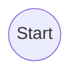
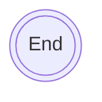
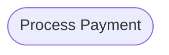
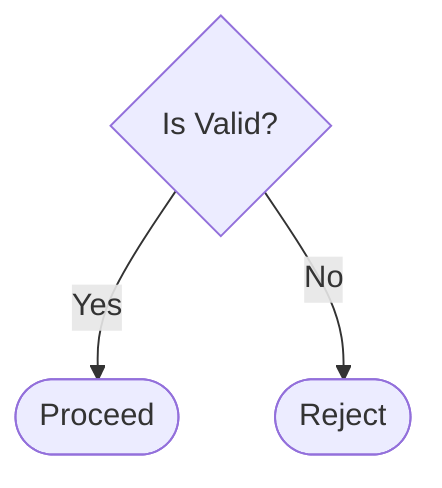
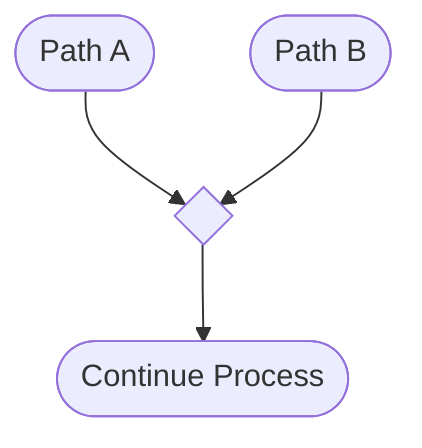
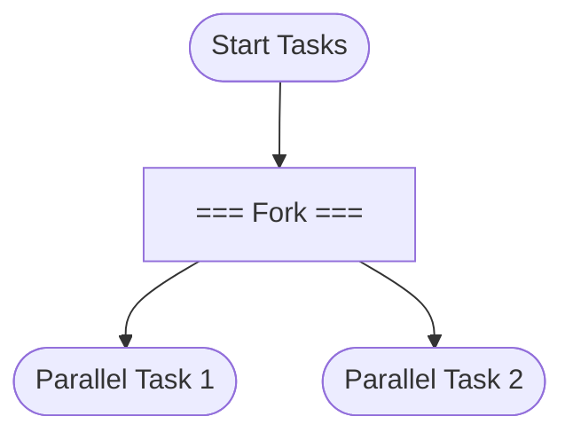
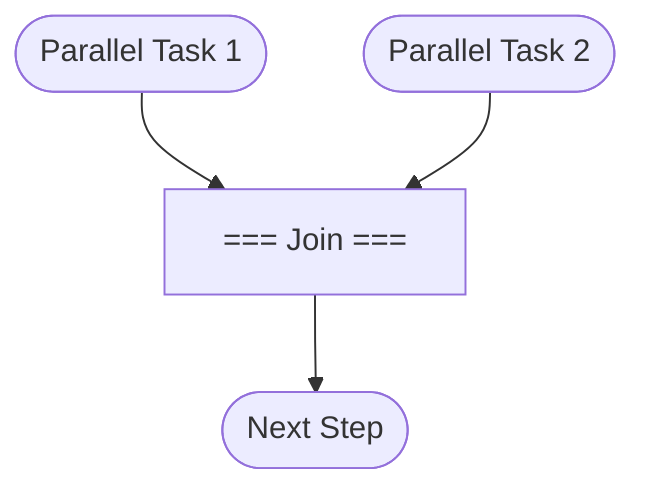
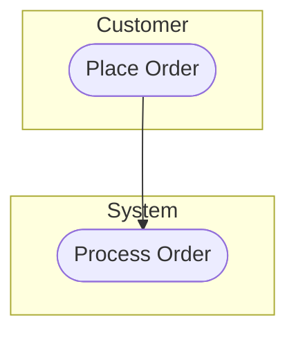
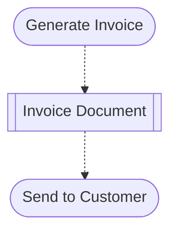

# Activity Diagram Masterclass

## Part 1: What is an Activity Diagram? (The Mental Model)

Think of an Activity Diagram as a **flowchart on steroids**. While standard flowcharts are great for simple, single-threaded logic, Activity Diagrams are designed to model complex business processes and system behaviors. They show the **FLOW of activities**, emphasizing the sequence and conditions under which actions occur.

**The Recipe Analogy:**
Imagine you are following a recipe to bake a cake.
- You have **Steps** (actions): Mix flour, bake at 350°F.
- You have **Decisions** (branches): Is the batter too dry? If yes, add milk. If no, proceed.
- You have **Parallel Tasks** (concurrency): Preheat the oven *while* you mix the batter. You don't wait for the oven to finish preheating to start mixing.
- You have a clear **Start** and **End**.

**Key Insight:** Activity diagrams answer **"WHAT happens and in WHAT ORDER"**. 
- They do *not* focus purely on "WHO does it" (that's for Use Case Diagrams, though we can use swimlanes here to help). 
- They do *not* focus on "HOW objects talk to each other" (that's for Sequence Diagrams).

---

## Part 2: The Complete Notation Cheat Sheet

Here are the essential building blocks for drawing Activity Diagrams, along with how to represent them using Mermaid flowcharts.

### 1. Initial Node (Start)
- **Symbol Name:** Initial Node
- **Explanation:** Marks the starting point of the activity flow. There is usually only one per diagram (or one per swimlane).
- **When to use it:** Always. Every diagram must have a start.


### 2. Final Node (End)
- **Symbol Name:** Final Node / Activity Final
- **Explanation:** Marks the completion of the entire activity. 
- **When to use it:** Always. Every path should eventually lead to a final node (or flow final).


### 3. Action / Activity
- **Symbol Name:** Action Node
- **Explanation:** Represents a single step, task, or operation being performed.
- **When to use it:** Whenever something is *done* (e.g., "Verify Password", "Send Email").


### 4. Decision Node
- **Symbol Name:** Decision Node
- **Explanation:** A branching point where the flow splits based on a condition (Exclusive OR - only one path is taken).
- **When to use it:** For "if/else" or "switch" logic.


### 5. Merge Node
- **Symbol Name:** Merge Node
- **Explanation:** Brings multiple alternative flows (from a decision) back together into a single flow.
- **When to use it:** After a decision's branches have completed their unique steps and the main process resumes.


### 6. Fork Node
- **Symbol Name:** Fork Node
- **Explanation:** Splits a single flow into two or more parallel, concurrent flows (AND - all paths happen at the same time).
- **When to use it:** When tasks can or must happen simultaneously.


### 7. Join Node
- **Symbol Name:** Join Node
- **Explanation:** Synchronizes multiple parallel flows back into a single flow. The flow only continues when *all* incoming parallel paths are complete.
- **When to use it:** To close a fork.


### 8. Swimlanes
- **Symbol Name:** Partitions / Swimlanes
- **Explanation:** Groups actions based on who or what is performing them (Actors, Systems, Departments).
- **When to use it:** When a process involves multiple participants and you need to clarify responsibility.


### 9. Guard Conditions
- **Symbol Name:** Guard
- **Explanation:** A boolean condition placed on an edge (usually leaving a Decision Node) that must be true for that path to be taken.
- **When to use it:** To label the arrows coming out of a diamond.
```mermaid
graph TD
    Decision{Age?}
    Decision -->|[Age < 18]| Minor([Block Access])
    Decision -->|[Age >= 18]| Adult([Grant Access])
```

### 10. Object Nodes
- **Symbol Name:** Object Node
- **Explanation:** Represents data or an object that is created, modified, or used by an action.
- **When to use it:** When the flow of data is as important as the flow of control (e.g., passing a "Signed Document").


---

## Part 3: The 5-Step Method to Solve ANY Activity Diagram Problem

Don't just start drawing boxes. Follow this systematic approach to build a bulletproof diagram.

### Step 1: HIGHLIGHT the text
Go through the problem sentence by sentence and color-code or tag the elements:
- 🟦 **Blue = Actions** (verbs: fills out, signs, sends, checks)
- 🟨 **Yellow = Decisions** (if, when, otherwise, whether)
- 🟩 **Green = Actors/Swimlanes** (student, chairperson, system, customer)
- 🟥 **Red = Parallel flows** (simultaneously, at the same time, meanwhile, both...and)
- 🟪 **Purple = End conditions** (expires, filed away, denied, completed)

### Step 2: LIST the building blocks
Create a quick mental or physical table to organize what you found.
| Actors (Green) | Actions (Blue) | Decisions (Yellow) | Parallel? (Red) | End States (Purple) |
|---|---|---|---|---|
| ... | ... | ... | ... | ... |

### Step 3: CHAIN the actions
Ignore the actors for a moment. Just connect the actions (Blue) in chronological order. Insert your Decisions (Yellow) and Forks/Joins (Red) where appropriate. Create a single, logical flow from Start to End.

### Step 4: ADD swimlanes
Now that the logic works, draw your swimlanes (Green). Move the actions into the lane of the actor responsible for performing them. Ensure the arrows gracefully cross boundaries.

### Step 5: VERIFY
Read the original text again, tracing your finger along the diagram. 
- Is every sentence represented? 
- Are all decision branches covered with Guard Conditions? 
- Do all parallel paths join back up (or end appropriately)?

---

## Part 4: Common Mistakes & How to Avoid Them

1. **Forgetting merge nodes after decisions:** 
   Don't just point two alternative branches directly into the next action. Point them into an empty diamond (Merge Node), and have *one* arrow leave the merge node to the next action. This keeps the flow clean.
2. **Not using fork/join for parallel activities:**
   If the text says "meanwhile," you need a thick bar (Fork) to split the path, and another thick bar (Join) to wait for both to finish.
3. **Missing guard conditions on decision branches:**
   A diamond is useless if the arrows leaving it don't say *why* they were chosen (e.g., `[Valid]` vs `[Invalid]`). Always label decision outputs.
4. **Putting all actions in one lane when multiple actors exist:**
   If the problem mentions a Customer and a System, use swimlanes! Don't cram it all into a single column.
5. **Confusing decision (exclusive OR) with fork (parallel AND):**
   - Diamond = Choose ONE path.
   - Thick Bar = Take ALL paths at the same time.

---

## Part 5: A Worked Mini-Example

**The Scenario:**
> "A customer orders coffee. The barista checks if the order is hot or cold. For hot drinks, the barista steams milk while the machine brews espresso. For cold drinks, the barista blends ice. Both paths end with the barista serving the drink."

### Step 1: HIGHLIGHT
- 🟦 Actions: orders coffee, checks if hot or cold, steams milk, brews espresso, blends ice, serving the drink.
- 🟨 Decisions: if the order is hot or cold.
- 🟩 Actors: customer, barista, machine.
- 🟥 Parallel flows: steams milk *while* machine brews espresso.
- 🟪 End conditions: serving the drink.

### Step 2: LIST the building blocks
| Actors (Green) | Actions (Blue) | Decisions (Yellow) | Parallel? (Red) | End States (Purple) |
|---|---|---|---|---|
| Customer, Barista, Machine | Order coffee, Check temp, Steam milk, Brew espresso, Blend ice, Serve drink | Hot or Cold? | Steam milk AND Brew espresso | Serve drink |

### Step 3: CHAIN the actions (Mental Draft)
Start -> Order -> Check Temp -> 
If Hot -> Fork -> (Steam Milk & Brew Espresso) -> Join -> Merge -> Serve -> End
If Cold -> Blend Ice -> Merge -> Serve -> End

### Step 4: ADD swimlanes (The Final Diagram)
We have three actors: Customer, Barista, Machine. Let's arrange them and place the actions.

### Step 5: VERIFY & The Complete Diagram
- Customer orders? Yes.
- Barista checks temp? Yes.
- Hot: milk and espresso happen simultaneously (fork/join across lanes)? Yes.
- Cold: barista blends ice? Yes.
- Both end with serving? Yes (handled via a Merge node before serving).

```mermaid
graph TD
    subgraph Customer
        Start((Start)) --> Order([Order Coffee])
        Receive([Receive Drink]) --> End(((End)))
    end

    subgraph Barista
        Order --> Check{Hot or Cold?}
        
        %% Hot Path
        Check -->|[Hot]| Fork1[=== Fork ===]
        Fork1 --> Steam([Steam Milk])
        
        %% Cold Path
        Check -->|[Cold]| Blend([Blend Ice])
        
        %% Join & Merge
        Steam --> Join1[=== Join ===]
        
        Blend --> Merge1{ }
        Join1 --> Merge1
        
        Merge1 --> Serve([Serve Drink])
        Serve --> Receive
    end

    subgraph Machine
        %% Parallel task for Hot Path
        Fork1 --> Brew([Brew Espresso])
        Brew --> Join1
    end
```
