# Sequence Diagram Masterclass: The Fundamentals

Welcome to your first step in mastering System Analysis and Design (CSE-471)! This document is your foundational guide to Sequence Diagrams. We'll start with intuition, move to notation, and finally provide a foolproof method for solving any problem you encounter.

---

## Part 1: What is a Sequence Diagram? (The Mental Model)

Think of a sequence diagram as a **conversation between objects** — very much like a WhatsApp group chat, but with strict timestamps and a formal layout.

**The Key Insights:**
- **Time flows from TOP to BOTTOM.** The higher up a message is, the earlier it happened.
- **Objects are arranged from LEFT to RIGHT.** We place the actors or objects interacting in the scenario side by side across the top.
- **Each arrow is a message.** Every interaction is someone asking someone else to do something, or giving them an answer.

**The Real-Life Analogy:**
Imagine ordering food at a restaurant:
1. You (Customer) tell the Waiter your order.
2. The Waiter takes your order to the Kitchen.
3. The Kitchen prepares the food and hands it to the Waiter.
4. The Waiter brings the food to you.

If you can trace who is talking to whom, and in what order, you already know how to build a sequence diagram!

---

## Part 2: The Complete Notation Cheat Sheet

Here are the building blocks you'll use. We use Mermaid syntax to render these diagrams — you can copy/paste these snippets directly into Mermaid Live or any markdown viewer that supports it.

### 1. Participant / Actor
- **What it is:** The entities involved (people or systems).
- **Mermaid:** `participant Name` or `actor Name`
- **When to use:** To define who is participating at the top of the diagram.

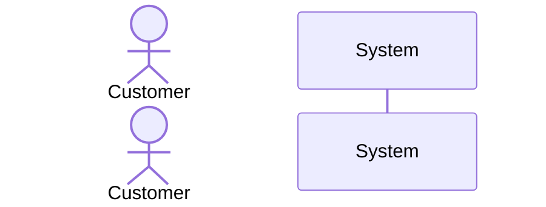

### 2. Lifeline
- **What it is:** The dashed vertical line dropping down from an object, representing its existence over time.
- **Mermaid:** (Automatic when you add a participant and send messages)
- **When to use:** Always present implicitly.

### 3. Synchronous Message
- **What it is:** A request where the sender waits for a response (solid line with solid arrowhead).
- **Mermaid:** `A->>B: doSomething()`
- **When to use:** When one object tells another to do a task and pauses until it's done (e.g., calling a method).

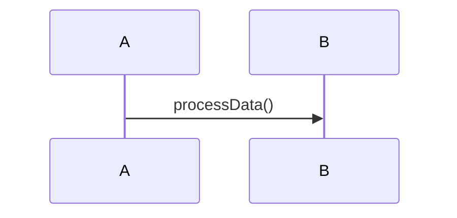

### 4. Return Message
- **What it is:** A response to a previous message (dashed line).
- **Mermaid:** `B-->>A: result`
- **When to use:** When a task is complete and a value or acknowledgment is sent back.

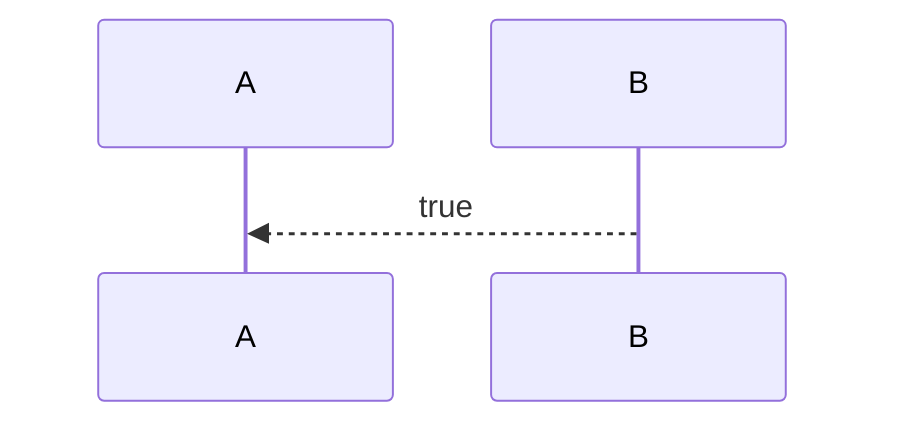

### 5. Self-Message
- **What it is:** An object performing an internal action.
- **Mermaid:** `A->>A: validate()`
- **When to use:** When an object calls one of its own methods before talking to someone else.

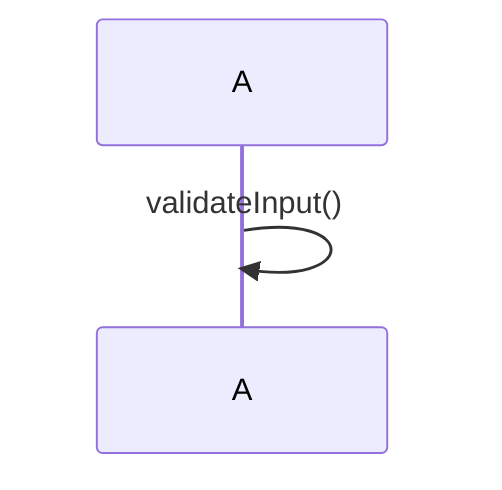

### 6. Create Message
- **What it is:** A message that creates a new object instance.
- **Mermaid:** `create participant B` followed by `A->>B: new()`
- **When to use:** When a new object is instantiated during the sequence.

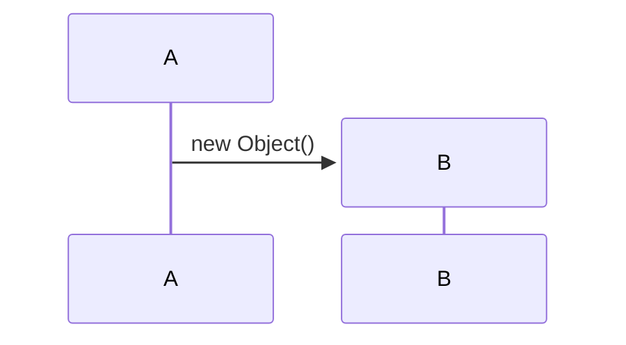

### 7. Destroy (Destruction)
- **What it is:** Denotes that an object has been deleted or memory freed (usually an 'X' on the lifeline).
- **Mermaid:** `destroy B`
- **When to use:** When an object's lifespan ends.

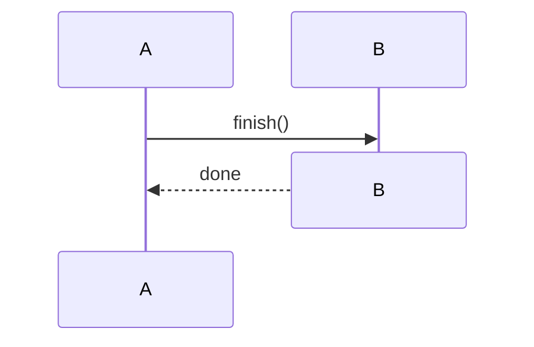

### 8. Activation Bar
- **What it is:** A rectangle on the lifeline showing that an object is actively processing or "doing work."
- **Mermaid:** `activate B` (start) and `deactivate B` (end), or use `+` / `-` shorthand.
- **When to use:** After receiving a message until the return message is sent.

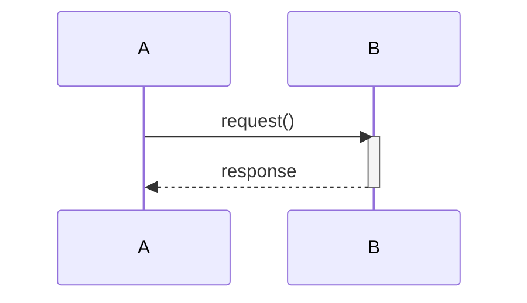

### 9. Alt/Else Fragment
- **What it is:** Represents `if-else` conditional logic.
- **Mermaid:** `alt condition ... else ... end`
- **When to use:** When the sequence branches into two or more mutually exclusive paths.

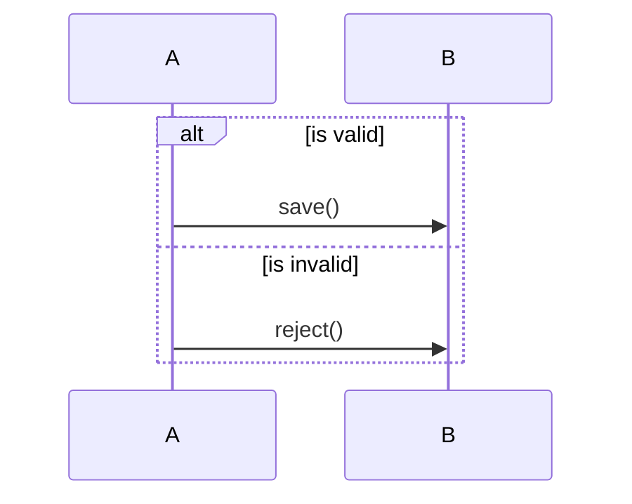

### 10. Loop Fragment
- **What it is:** Represents a repetition (`for` or `while` loop).
- **Mermaid:** `loop condition ... end`
- **When to use:** When an action happens multiple times.

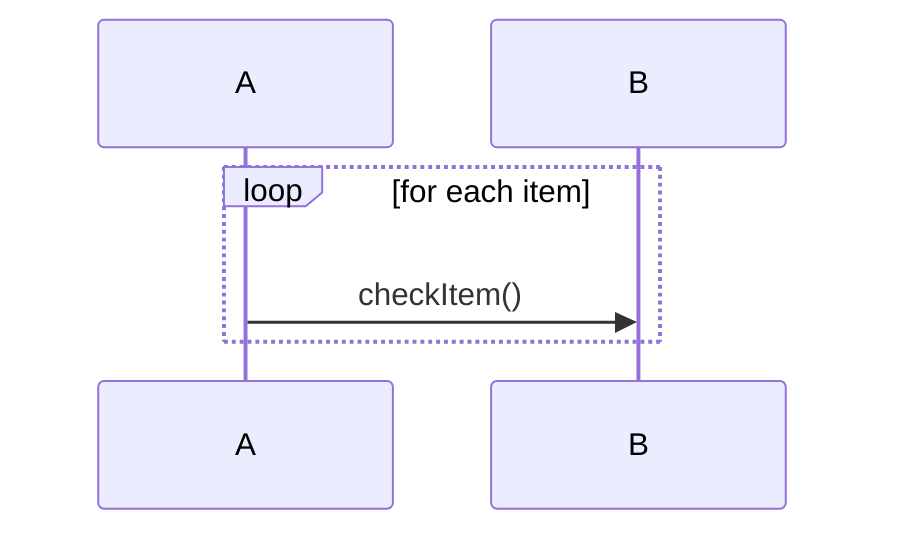

### 11. Opt Fragment
- **What it is:** Represents an optional sequence (`if` without an `else`).
- **Mermaid:** `opt condition ... end`
- **When to use:** When an action only happens under a specific condition, but normal flow resumes regardless.

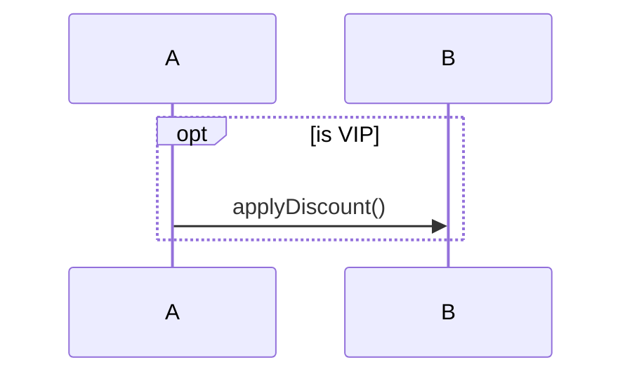

### 12. Par Fragment
- **What it is:** Represents parallel or concurrent processes.
- **Mermaid:** `par task1 and task2 end`
- **When to use:** When two or more independent actions happen simultaneously.

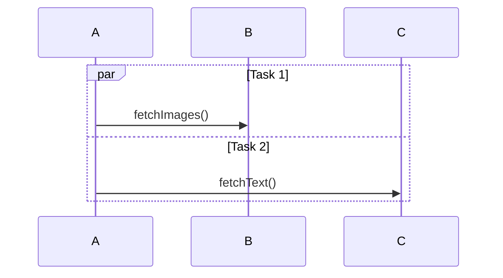

### 13. Notes
- **What it is:** Text annotations to explain parts of the diagram.
- **Mermaid:** `Note right of A: text` or `Note over A,B: text`
- **When to use:** Whenever extra context or explanation is helpful.

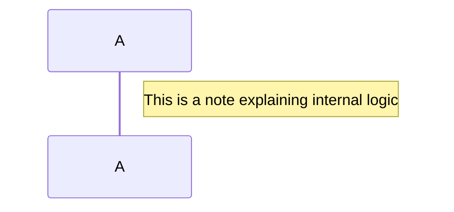

---

## Part 3: The 5-Step Method to Solve ANY Sequence Diagram Problem

When you get a scenario description in an exam or project, don't panic. Just follow these 5 steps sequentially.

### Step 1: IDENTIFY THE OBJECTS
Read the problem and list every noun that participates in the action.
- **People/Actors:** User, Customer, Student, Admin
- **System Components:** SearchEngine, Database, Cart, Server, Controller
- **The Rule:** If it sends or receives a message, it's a participant!

### Step 2: TRACE THE MESSAGES
Go through the text sentence by sentence.
- Find the **VERB** — that's the message.
- Find **WHO** does it — that's the sender.
- Find **TO WHOM** it is done — that's the receiver.
- Write it down as: `Sender ->> Receiver: verb(details)`

### Step 3: SPOT THE FRAGMENTS
Scan the text for keywords that imply logic beyond a straight line:
- *"if... otherwise/else"* → Use an `alt/else` fragment.
- *"may", "can", "optionally"* → Use an `opt` fragment.
- *"repeat", "again", "multiple times"* → Use a `loop` fragment.
- *"simultaneously", "at the same time"* → Use a `par` fragment.
- *"up to 3 times"* → Use a `loop [1..3]` fragment.

### Step 4: ADD ACTIVATION BARS
When an object is "doing work" (processing data, querying a DB) after receiving a message, it is activated. Deactivate it when it sends its return message. 

### Step 5: VERIFY
Do a final self-check. Every sentence in the prompt should map to at least one message. Ensure that every request that requires an answer has a corresponding return message.

---

## Part 4: Common Mistakes & How to Avoid Them

- **Forgetting return messages:** Every request (`A->>B`) usually needs a response (`B-->>A`), unless it's a one-way notification.
- **Not using activation bars:** Without them, it's hard to tell when an object is actively working versus sitting idle.
- **Wrong arrow direction:** The sender's side has the flat line; the receiver gets the arrowhead. SENDER sends, receiver receives!
- **Missing fragments for conditional logic:** Don't draw two contradictory flows in a straight sequence. If it's an "either/or" situation, you MUST use an `alt` fragment.
- **Confusing participants with messages:** Nouns are usually participants. Verbs are messages. Don't make "Login" a participant if it's an action.
- **Creating too many or too few participants:** If an object never sends or receives a message, it shouldn't be there. If an action happens "magically", you might be missing an actor or a backend system.

---

## Part 5: A Worked Mini-Example

**The Scenario:**
> *"A user logs into a website. The website sends the credentials to the AuthService. The AuthService checks the database for the user. If the user exists and password matches, the AuthService returns a token to the website, which shows a welcome page. If the password is wrong, an error message is shown. If the user doesn't exist, a registration link is shown."*

### Applying the 5 Steps:

**Step 1: Identify the Objects**
- Nouns participating: `User`, `Website`, `AuthService`, `Database`.

**Step 2: Trace the Messages**
- "User logs into a website" → `User ->> Website: login(credentials)`
- "Website sends credentials to AuthService" → `Website ->> AuthService: authenticate(credentials)`
- "AuthService checks database" → `AuthService ->> Database: queryUser(credentials)`

**Step 3: Spot the Fragments**
- *"If the user exists... If the password is wrong... If the user doesn't exist..."*
- This is a complex `if/else if/else` block. We need an `alt` fragment with multiple branches!

**Step 4 & 5: Add Activation Bars & Verify**
- Let's put it all together in Mermaid and check our work against the text.

### The Complete Diagram

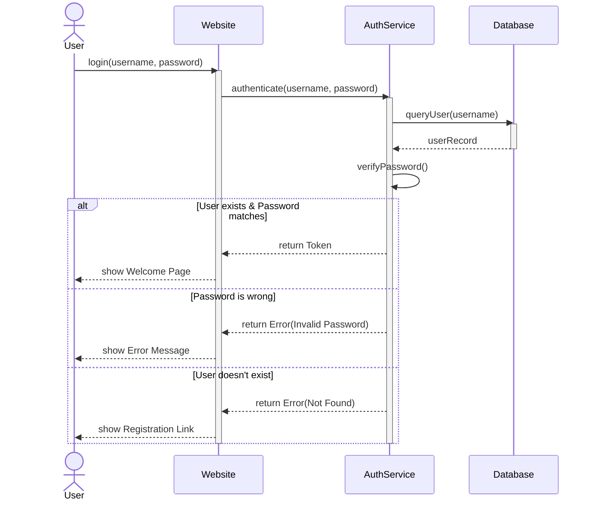

Notice how we built intuition from simple text to a complete architectural blueprint! Keep practicing these 5 steps, and sequence diagrams will become second nature.
