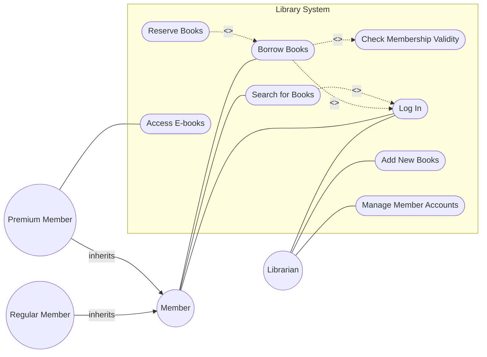

# Use Case Diagram Masterclass

## Part 1: What is a Use Case Diagram? (The Mental Model)
- It's a bird's-eye view of **WHAT** a system does for its users — not **HOW** it does it.
- **Analogy:** Think of a restaurant menu. The **ACTORS** are the customers and staff. The **USE CASES** are the items on the menu (things the system offers). The **SYSTEM BOUNDARY** is the restaurant itself.
- **Key insight:** Use Case Diagrams answer "WHO uses the system and WHAT can they do with it?"
- They do NOT show the order of operations (that's Activity Diagrams) or how objects communicate (that's Sequence Diagrams).
- They are a **REQUIREMENTS tool** — they capture what the system must support.

## Part 2: The Complete Notation Cheat Sheet

Here are the elements you will use to build Use Case Diagrams in Mermaid:

1. **Actor**
   - **Symbol:** Stick figure representing someone/something OUTSIDE the system interacting with it.
     - *Primary Actor:* Initiates the interaction.
     - *Secondary Actor:* System reaches out to it (e.g., Payment Gateway, Email Server).
   - **Mermaid:** `ActorName((Actor Name))`
   - **When to use:** Whenever representing a user role or external system.

2. **Use Case**
   - **Symbol:** Ellipse, representing specific functionality the system provides.
   - **Mermaid:** `UC1([Use Case Name])`
   - **When to use:** For user-facing actions/verbs.

3. **System Boundary**
   - **Symbol:** Rectangle enclosing all use cases.
   - **Mermaid:** `subgraph SystemName`
   - **When to use:** To define the scope of the system.

4. **Association**
   - **Symbol:** Solid line connecting actor to use case.
   - **Mermaid:** `ActorName --- UC1`
   - **When to use:** When an actor participates in a use case.

5. **Include Relationship**
   - **Symbol:** Dashed arrow FROM base TO included with `<<include>>`.
   - **Analogy:** "Every time I order food, I MUST pay" → Order Food `<<include>>` Process Payment
   - **Mermaid:** `UC1 -.->|<<include>>| UC2`
   - **When to use:** The included use case is ALWAYS executed.

6. **Extend Relationship**
   - **Symbol:** Dashed arrow FROM extending TO base with `<<extend>>`.
   - **Analogy:** "When I order food, I CAN optionally add dessert" → Add Dessert `<<extend>>` Order Food
   - **Mermaid:** `UC2 -.->|<<extend>>| UC1`
   - **When to use:** The extending use case is OPTIONALLY executed.

7. **Generalization (Actor)**
   - **Symbol:** Solid arrow from child to parent actor.
   - **Mermaid:** `ChildActor -->|inherits| ParentActor`
   - **When to use:** Child inherits all use cases of parent AND can have additional ones (e.g., Premium Customer inherits from Customer).

8. **Generalization (Use Case)**
   - **Symbol:** Solid arrow from child to parent use case.
   - **Mermaid:** `ChildUC --> ParentUC`
   - **When to use:** E.g., Pay by Card and Pay by Cash both generalize Pay.

### Include vs Extend Comparison

| Feature | Include | Extend |
|---------|---------|--------|
| **Required?** | Always | Optional |
| **Arrow direction** | Base → Included | Extending → Base |
| **Think of it as** | "I MUST also do this" | "I CAN optionally do this" |
| **Example** | Login `<<include>>` Validate Credentials | Apply Coupon `<<extend>>` Checkout |

---

## Part 3: The 5-Step Method to Solve ANY Use Case Diagram Problem

**Step 1: IDENTIFY THE ACTORS** — Read the problem and find:
- 🧑 **Roles/Users:** Customer, Teacher, Admin, Student
- 🤖 **External Systems:** Payment Gateway, Email Server, Database
- 👥 **Generalization:** "Two types of students: BSc and MSc" → BSc and MSc generalize Student
- **Rule:** The SYSTEM ITSELF is never an actor!

**Step 2: EXTRACT THE USE CASES** — For each actor, list what they CAN DO:
- Look for action verbs: create, view, submit, approve, delete, search, pay
- Each use case should be a verb phrase: "Create Assignment", "Submit Report"
- Don't include implementation details ("Save to Database" is NOT a use case)

**Step 3: FIND THE RELATIONSHIPS**:
- "must also", "requires", "validated by" → **Include**
- "can optionally", "may", "might", "depending on" → **Extend**
- "Two types of X: A and B" → **Generalization** (A, B inherit from X)
- "Payment can be via card or bKash" → **Generalization** of the Pay use case

**Step 4: DRAW THE DIAGRAM**:
- Place actors on LEFT (primary) and RIGHT (secondary)
- Wrap use cases in a system boundary box
- Connect with appropriate relationships

**Step 5: VERIFY**:
- Every actor connects to at least one use case?
- Every use case connects to at least one actor?
- Include/Extend arrows point in the RIGHT direction?
- System boundary contains ALL use cases?

---

## Part 4: Common Mistakes & How to Avoid Them

1. **Confusing Include vs Extend arrow direction**
   - **Include:** FROM base TO required.
   - **Extend:** FROM optional TO base.
2. **Making the System an actor** — The system is the boundary box, never a stick figure.
3. **Using nouns as use cases** — "Password" is wrong. "Validate Password" is correct.
4. **Including internal processes** — "Save to DB" or "Hash Password" are internal, not user-facing use cases.
5. **Missing generalization** — If the problem says "two types of users: X and Y", you NEED a parent actor with generalization arrows.
6. **Over-using Include/Extend** — Not every connection needs these. Simple actor-to-use-case association is often sufficient.
7. **Forgetting secondary actors** — Payment gateways, email systems, external services are actors too.

---

## Part 5: A Worked Mini-Example

**Scenario:**
> "A library system allows members to search for books and borrow them. When borrowing, the system must check membership validity. Members can optionally reserve books that are currently checked out. Librarians can add new books and manage member accounts. Both members and librarians must log in first. There are two types of members: Regular and Premium. Premium members can access e-books."

### Applying the 5 Steps:

**Step 1: Identify Actors**
- Member (Parent)
- Regular Member (Child of Member)
- Premium Member (Child of Member)
- Librarian

**Step 2: Extract Use Cases**
- Member: Search Books, Borrow Books, Reserve Books, Log In
- Premium Member: Access E-books
- Librarian: Add New Books, Manage Member Accounts, Log In
- System (Internal required): Check Membership Validity

**Step 3: Find Relationships**
- "Borrow Books" **includes** "Check Membership Validity"
- "Reserve Books" **extends** "Borrow Books" (or is a separate UC depending on interpretation; here it's an optional action when borrowing or searching). We'll make it extend "Borrow Books".
- "Search Books", "Borrow Books", "Add New Books", "Manage Member Accounts" all **include** "Log In" (or rather, "Log In" is a prerequisite, so they can include it).
- Regular Member and Premium Member **generalize** Member.

**Step 4: Draw the Diagram**

*(Note: To avoid crossing lines or making the diagram too messy, sometimes Log In is associated directly with actors, or shown as an include from major use cases. Both are valid in Mermaid, but remember the core logic of your requirements!)*

**Step 5: Verify**
- All actors connected? Yes.
- Include arrow from Borrow to Check Validity? Yes.
- Extend arrow from Reserve to Borrow? Yes.
- Generalization correct? Yes, child arrows point to Member.
