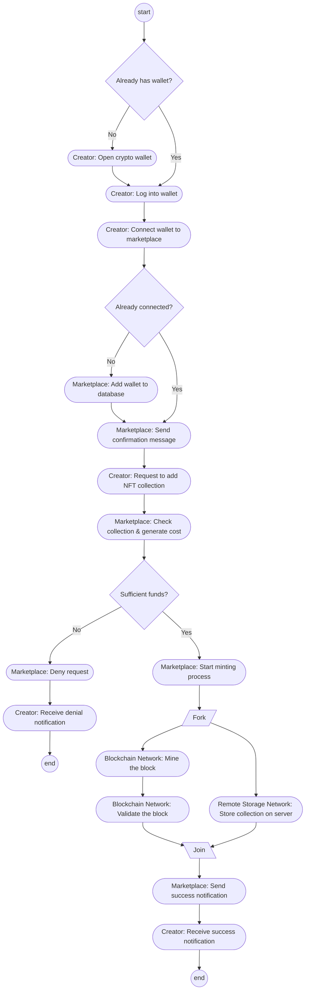

# Activity Diagram: NFT Marketplace

## 📋 Problem Statement

> Non-Fungible Tokens (NFT) are an application of blockchains where the proof of ownership of an asset is placed on the blockchain network and the owner of the asset has the hash of the block stored in a digital wallet. First the creator of a NFT collection opens up a crypto wallet and then logs into it, if the creator already has a wallet, then s/he just logs in. After that, the creator connects his/her wallet to a marketplace, during the connection process, the marketplace will check if the wallet is already connected or not, if the wallet was not connected, then the wallet will be added to the database and a confirmation message will be sent, otherwise just the confirmation message will be sent. After connecting the wallet, the creator will request to add the NFT collection to the marketplace. The marketplace will check the collection and generate a minting cost in cryptocurrency and then will check if the wallet contains sufficient cryptocurrency to mint (add) the collection. If sufficient cryptocurrency is not present, the request will be denied. If sufficient cryptocurrency is present, then the marketplace will start the minting process. In the minting process, requests are sent to the blockchain network and the remote storage network. The blockchain network mines the block and then validates the block, the remote storage network stores the collection on a server. After both these processes are complete, the creator is sent a notification of the success.
>
> *Construct an activity diagram from the above scenario.*

---

Welcome to the problem-solving guide for the NFT Marketplace process! We'll use the 5-step method to model a flow that contains sequential decisions followed by parallel execution.

## Step 1: Read & Highlight
Let's break down the problem text and see what structural elements we can extract.

> "First the creator of a NFT collection opens up a crypto wallet and then logs into it, if the creator already has a wallet, then s/he just logs in."
**Element Type:** Actor (`Creator`), Decision (`Already has wallet?`), Actions (`Open wallet`, `Log in`).

> "After that, the creator connects his/her wallet to a marketplace, during the connection process, the marketplace will check if the wallet is already connected or not..."
**Element Type:** Actor (`Marketplace`), Action (`Connect wallet`), Decision (`Already connected?`).

> "...if the wallet was not connected, then the wallet will be added to the database and a confirmation message will be sent, otherwise just the confirmation message will be sent."
**Element Type:** Actions (`Add to database`, `Send confirmation`).

> "After connecting the wallet, the creator will request to add the NFT collection to the marketplace."
**Element Type:** Action (`Request to add NFT collection`).

> "The marketplace will check the collection and generate a minting cost in cryptocurrency and then will check if the wallet contains sufficient cryptocurrency to mint (add) the collection. If sufficient cryptocurrency is not present, the request will be denied."
**Element Type:** Actions (`Check collection`, `Generate minting cost`), Decision (`Sufficient funds?`), Action (`Deny request`).

> "If sufficient cryptocurrency is present, then the marketplace will start the minting process. In the minting process, requests are sent to the blockchain network and the remote storage network."
**Element Type:** Parallel Execution (**FORK!**). Sending requests to two different independent systems indicates parallel processing.

> "The blockchain network mines the block and then validates the block, the remote storage network stores the collection on a server."
**Element Type:** Actors (`Blockchain Network`, `Remote Storage Network`), Actions (`Mine block`, `Validate block`, `Store collection`). Notice that the blockchain has a sequence (mine -> validate) *inside* its parallel branch.

> "After both these processes are complete, the creator is sent a notification of the success."
**Element Type:** Synchronization (**JOIN!**), Action (`Notify success`).

## Step 2: Extract the Building Blocks

**Actors (Swimlanes):**
- Creator
- Marketplace
- Blockchain Network
- Remote Storage Network

**Decisions:**
1. Has wallet? (Yes/No)
2. Already connected? (Yes/No)
3. Sufficient funds? (Yes/No)

**Parallel Elements:**
- **Fork:** Marketplace sends requests to Blockchain and Storage.
- **Branch 1 (Blockchain):** Mine block -> Validate block.
- **Branch 2 (Storage):** Store collection.
- **Join:** Merge after validation and storage are complete.

## Step 3: Build the Flow
1. **Start:** `Creator` decides to engage. Does they have a wallet?
2. If No -> Open wallet. Both paths then merge to -> Log into wallet.
3. `Creator` connects wallet to `Marketplace`.
4. `Marketplace` checks: Is it already connected?
5. If No -> Add to database -> Send confirmation. If Yes -> just Send confirmation.
6. `Creator` requests to add NFT.
7. `Marketplace` checks collection and generates cost.
8. Decision: Does `Creator` have enough funds?
9. If No -> Deny request (End).
10. If Yes -> Start minting process. **FORK!**
11. **Parallel Path 1 (Blockchain):** Mine the block, THEN validate the block.
12. **Parallel Path 2 (Storage):** Store the collection on the server.
13. **JOIN:** Wait for both networks to finish.
14. Send success notification to `Creator` (End).

## Step 4: The Complete Diagram

## Step 5: Self-Check
Ask yourself these questions to verify your diagram:
1. **Did I model sequential steps inside a parallel branch correctly?** The blockchain network has `Mine block` followed by `Validate block`. These must run in sequence on that specific path before joining.
2. **Did I handle all three decisions cleanly?** Make sure decisions like "Already has wallet?" merge back appropriately (to logging in) rather than ending the flow prematurely.
3. **Who does the final notification?** The text implies the marketplace orchestrates this after receiving confirmation from the two networks, sending the final message to the creator.
