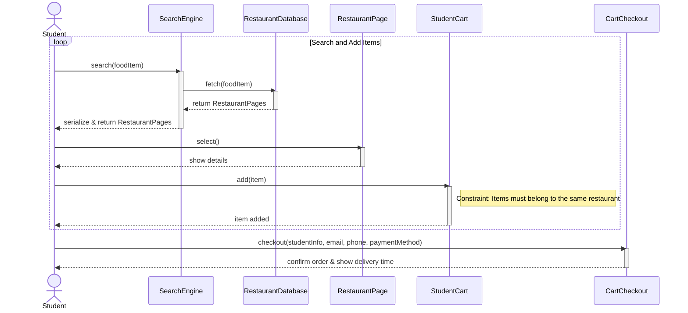

# Sequence Diagram Practice: ABEC Food Ordering

Let's break down this sequence diagram problem step-by-step to build our intuition.

## Step 1: Identify the Objects
First, we read through the text and pick out the nouns that act as actors or system components.
- **Student**: The actor initiating actions.
- **SearchEngine**: Receives search requests.
- **RestaurantDatabase**: Queried by the SearchEngine.
- **RestaurantPage**: Returned and selected by the student.
- **StudentCart**: Where items are added.
- **CartCheckout**: Handles the final ordering process.

## Step 2: Trace the Messages
Let's go sentence by sentence to find the sender, receiver, and message.
- Student visits site and searches food item -> SearchEngine
- SearchEngine fetches RestaurantPages -> RestaurantDatabase
- RestaurantDatabase returns RestaurantPages -> SearchEngine
- SearchEngine serializes and returns to -> Student
- Student selects -> RestaurantPage
- Student adds item to cart -> StudentCart
- StudentCart adds the item (internal or return)
- The student may search again (loop)
- Student selects check out -> CartCheckout (with info: student, email, phone, payment)
- System confirms order & shows delivery time

## Step 3: Spot the Fragments
Where are the control structures?
- **Loop**: "The student may again search for more than one food item... previous steps will be repeated." This is a `loop` fragment covering the search and add to cart process.
- **Note/Constraint**: "multiple food items can be added... if all belong to the same restaurant". We can represent this as a Note rather than a strict `alt`, as the flow doesn't explicitly branch based on it, it's just a business rule.

## Step 4: The Complete Diagram

## Step 5: Self-Check
Ask yourself:
- Did I include all the objects mentioned in the prompt?
- Is the loop encompassing the correct set of messages (search through add to cart)?
- Did I show the synchronous calls (solid arrows) and returns (dashed arrows)?
- Are the activation bars correct for when an object is processing a request?
