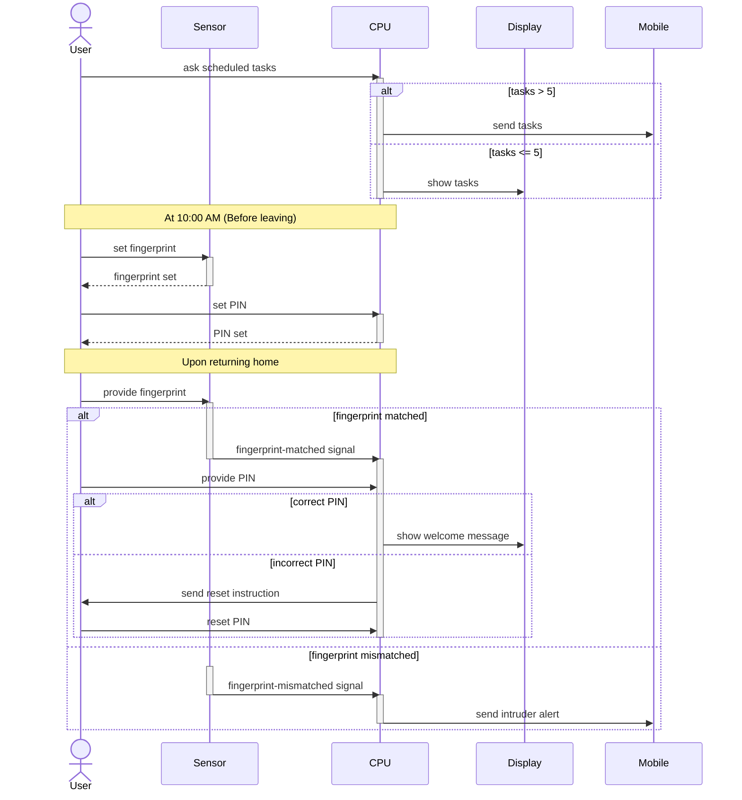

# Sequence Diagram Practice: Smart Home Automation

Let's break down this complex logical problem step-by-step.

## Step 1: Identify the Objects
Who and what are involved in this smart home?
- **User**: The actor.
- **CPU**: The central processing unit handling logic.
- **Sensor**: Handles fingerprint input.
- **Display**: Shows information to the user.
- **Mobile**: Receives remote alerts/tasks.

## Step 2: Trace the Messages
- User asks for scheduled tasks -> CPU
- CPU checks task count -> displays on Display OR sends to Mobile
- User sets fingerprint -> Sensor
- User sets PIN -> CPU
- (Time passes: User returns)
- User provides fingerprint -> Sensor
- Sensor verifies fingerprint and sends message -> CPU
- CPU checks PIN
- CPU shows welcome on Display OR sends instructions
- CPU sends intruder alert to Mobile (if fingerprint mismatched)

## Step 3: Spot the Fragments
This problem is heavy on alternatives (`alt`):
- **Alt 1 (Task Count)**: 
  - `if tasks > 5`: send to Mobile
  - `else`: show on Display
- **Nested Alts (Returning Home)**:
  - **Outer Alt**: Fingerprint match vs mismatch
    - `if matched`: CPU checks PIN
      - **Inner Alt**: PIN correct vs incorrect
        - `if correct`: Welcome on Display
        - `else`: Reset instructions to User
    - `else (mismatched)`: Intruder alert to Mobile

## Step 4: The Complete Diagram

## Step 5: Self-Check
- Did I properly nest the inner PIN check `alt` inside the "matched" condition of the outer fingerprint `alt`?
- Are messages going to the correct devices (Mobile for >5 tasks and intruder alert, Display for <=5 tasks and welcome message)?
- Did I capture the sequential setup steps before leaving?
