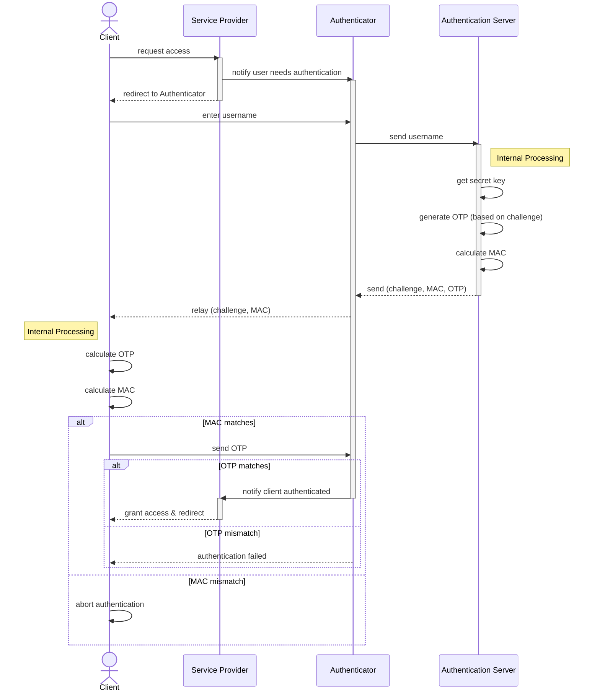

# Sequence Diagram Practice: OTP Authentication

Let's model this security protocol sequence diagram.

## Step 1: Identify the Objects
- **Client (User)**: The entity trying to authenticate.
- **SP (Service Provider)**: The service being accessed.
- **Authenticator**: The middleman relaying messages.
- **AS (Authentication Server)**: Generates and verifies OTP/MAC.

## Step 2: Trace the Messages
- Client requests access -> SP
- SP notifies -> Authenticator
- Session redirected, User enters username -> Authenticator
- Authenticator sends username -> AS
- AS gets secret key, generates OTP, calculates MAC (internal processing)
- AS sends (challenge, MAC, OTP) -> Authenticator
- Authenticator relays (challenge, MAC) -> Client
- Client calculates OTP and MAC (internal)
- Client compares MAC. If match -> Client sends OTP to Authenticator
- Authenticator compares OTP. If match -> notifies SP
- SP redirects session and grants access -> Client

## Step 3: Spot the Fragments
- **Self-messages**: AS generating OTP/MAC. Client calculating OTP/MAC.
- **Alt 1 (Client MAC Check)**: 
  - `if MAC matches`: Client sends OTP to Authenticator
  - `else`: Authentication aborted
- **Alt 2 (Authenticator OTP Check)**:
  - `if OTP matches`: Notify SP, grant access
  - `else`: (Implicit failure/abort)

## Step 4: The Complete Diagram

## Step 5: Self-Check
- Did I use self-messages (`Client->>Client`) to show internal calculations?
- Is it clear that the Authenticator keeps the OTP from the AS and only relays the challenge and MAC?
- Are the `alt` blocks placed where the decisions are actually made (Client checking MAC, Authenticator checking OTP)?
