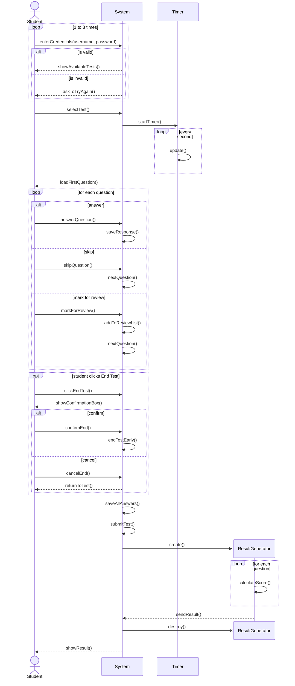

# Sequence Diagram Walkthrough: Online Examination System

## 📋 Problem Statement

> A student logs into an online examination system to take a timed multiple-choice test. First, the student enters their username and password. The system checks if the credentials are valid; if not, it asks the student to try again (this can repeat up to 3 times). If successful, the system shows the list of available tests. The student selects a test and starts it. The system then starts a timer (which updates itself every second) and loads the first question. If all the questions are not seen, for each question, the student can either answer it, skip it, or mark it for review. If the student answers, the system saves the response immediately. If they skip, the system moves to the next question. If they mark for review, the system adds the question to a separate review list and also goes to the next question. If the student clicks "End Test" before time is up, the system shows a confirmation box with two choices: confirm or cancel. If confirmation is selected, the test ends early. If cancellation is selected, the student returns to the test. When the timer runs out or the student confirms the end, the system saves all answers, submits the test. A result generator object is then created by the system, which calculates the score using its grading method (one question at a time until all are done), then sends the result back to the system. The system then destroys the result generator. Finally, the system shows the result to the student.

---

## Step 1: Identify the Objects
From the problem description, we can extract the main entities participating in the process:
- **Student**: The actor taking the exam.
- **System**: The main controller managing the exam flow.
- **Timer**: A background object tracking the time.
- **ResultGenerator**: A temporary object created just to calculate the score.

## Step 2: Trace the Messages
Let's break down the interactions:
- Student enters credentials to the System.
- System checks validity.
- Student selects a test, System starts Timer, loads first question.
- Timer updates itself.
- For a question, Student can answer, skip, or mark for review.
- Student may end early (needs confirmation).
- System saves answers, submits.
- System creates ResultGenerator, which calculates the score.
- System gets result and destroys ResultGenerator.
- System shows result.

## Step 3: Spot the Fragments
This problem is heavily driven by complex logic, which translates to fragments:
- **`loop` with `alt`**: The login process can repeat up to 3 times (`loop [1..3]`). Inside, we check if credentials are valid (`alt valid / invalid`).
- **`loop` (Timer)**: The timer updates itself every second.
- **`loop` with 3-way `alt`**: For each question, the student has three choices: answer, skip, or mark for review.
- **`opt` with `alt`**: Ending the test early is optional. If triggered, there is a confirmation choice (confirm / cancel).
- **Object Creation and Destruction**: The `ResultGenerator` is explicitly created (`create participant`) and destroyed (`destroy`) during the sequence.
- **`loop`**: The `ResultGenerator` loops to grade each question.

## Step 4: The Complete Diagram

## Step 5: Self-Check
- [ ] Did I use a `loop` and `alt` for the 3 login attempts?
- [ ] Did I include a self-message for the Timer's update?
- [ ] Is the three-way choice for handling questions inside a `loop`?
- [ ] Is the early termination inside an `opt` block with an `alt` for confirmation?
- [ ] Did I correctly use `create participant` and `destroy` for the ResultGenerator?
