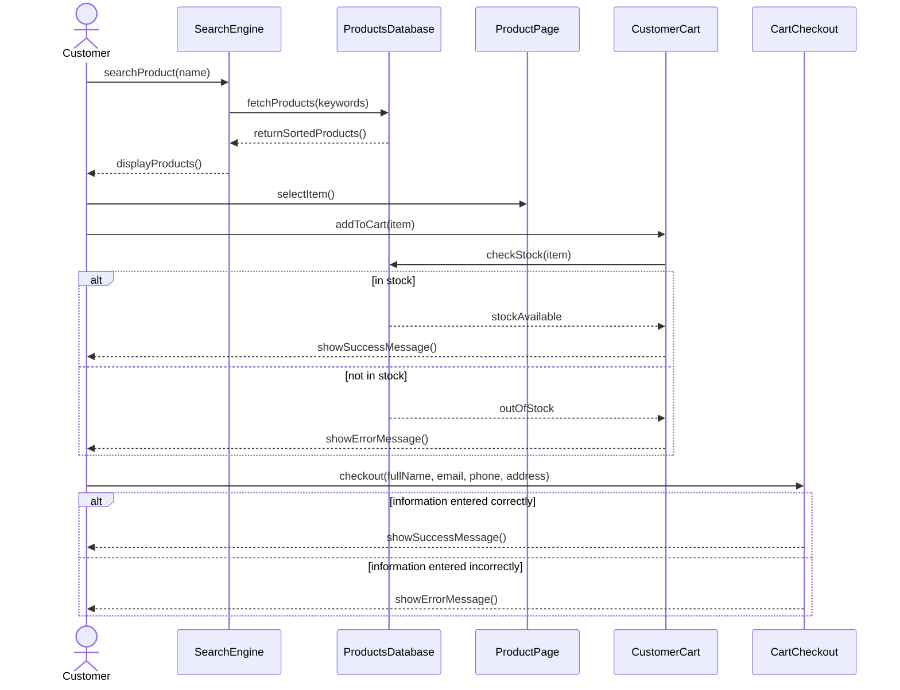

# Sequence Diagram Walkthrough: Ecommerce System

## Step 1: Identify the Objects
Based on the scenario, the entities are:
- **Customer**: The user of the site.
- **SearchEngine**: Handles finding products.
- **ProductsDatabase**: The data storage for products and stock.
- **ProductPage**: The interface for viewing a specific product.
- **CustomerCart**: Manages the items the user wants to buy.
- **CartCheckout**: Handles the final purchase process.

## Step 2: Trace the Messages
- Customer types product name -> SearchEngine
- SearchEngine fetches products from ProductsDatabase
- ProductsDatabase returns sorted products to SearchEngine
- SearchEngine shows products to Customer
- Customer selects item -> ProductPage
- Customer adds item to cart -> CustomerCart
- CustomerCart checks stock directly with ProductsDatabase
- CustomerCart shows success/error to Customer
- Customer enters info for checkout -> CartCheckout
- CartCheckout validates info and shows success/error to Customer

## Step 3: Spot the Fragments
- **`alt` for stock check**: When the `CustomerCart` requests a stock check from the `ProductsDatabase`, the outcome determines the next steps (in stock vs not in stock).
- **`alt` for checkout validation**: When the customer checks out, the entered information can be correct or incorrect, leading to a success or error message.

## Step 4: The Complete Diagram

## Step 5: Self-Check
- [ ] Did I show the standard request-response flow for the search?
- [ ] Did I include the direct communication between `CustomerCart` and `ProductsDatabase` without routing it through the user?
- [ ] Did I use an `alt` block for the stock checking logic?
- [ ] Did I use an `alt` block for the final checkout validation?
