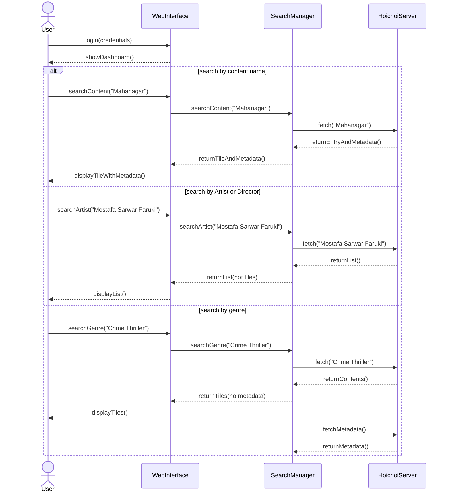

# Sequence Diagram Walkthrough: Hoichoi Streaming Service

## Step 1: Identify the Objects
From the problem description, we have:
- **User**: The person searching for content.
- **WebInterface**: The front-end relaying all communication.
- **SearchManager**: The backend component handling search logic.
- **HoichoiServer**: The main database/server storing content and metadata.

## Step 2: Trace the Messages
- User logs in via WebInterface (simple step).
- WebInterface shows dashboard.
- **Search by content name**: User searches -> WebInterface -> SearchManager -> Server. Server returns entry + metadata. SearchManager returns tile + metadata -> WebInterface -> User.
- **Search by Artist/Director**: User searches -> WebInterface -> SearchManager -> Server. Server returns list. SearchManager returns list (not tiles) -> WebInterface -> User.
- **Search by Genre**: User searches -> WebInterface -> SearchManager -> Server. Server returns contents. SearchManager returns tiles (without metadata) -> WebInterface -> User. **Crucially**, SearchManager then fetches metadata separately from the Server for later use.

## Step 3: Spot the Fragments
- **3-way `alt` block**: The user has three distinct ways to search, which means we need a large `alt` fragment with two `else` branches.
- **Relay Pattern**: All user messages go to the `WebInterface`, which then talks to the `SearchManager`. The user never talks to the `SearchManager` directly.
- **Asynchronous/Separate Fetching**: In the genre branch, the `SearchManager` fetches metadata from the `HoichoiServer` *after* returning the tiles to the `WebInterface`.

## Step 4: The Complete Diagram

## Step 5: Self-Check
- [ ] Did I enforce the rule that the User only communicates with the `WebInterface`?
- [ ] Are all three search types neatly structured in a single `alt` / `else` / `else` block?
- [ ] In the first branch, is the metadata explicitly returned with the tile?
- [ ] In the second branch, is a list returned instead of tiles?
- [ ] In the third branch, did I show the `SearchManager` fetching metadata from the server as a separate, distinct step?
