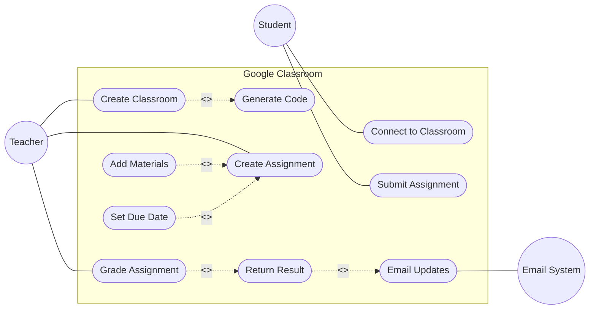

# Use Case Diagram: Google Classroom

Hey there! Let's break down this Google Classroom problem together. We'll extract the actors, use cases, and relationships step-by-step to build a solid Use Case Diagram.

## Step 1: Identify the Actors
Who interacts with the system?
- **Teacher**: Creates classrooms, adds materials, sets assignments, grades.
- **Student**: Connects to classrooms, submits assignments.
- **Email System**: Receives updates to send to users. *Note: This is a SECONDARY actor because the system sends information to it, not the other way around.*

## Step 2: Extract the Use Cases
What can these actors do? Look for the verbs!
- **Teacher**: Create Classroom, Create Assignment, Grade Assignment, Return Result.
- **Student**: Connect to Classroom, Submit Assignment.
- **System Actions**: Send Email Updates.

## Step 3: Find the Relationships
Let's find the `<<include>>` and `<<extend>>` relationships.
- Adding materials (YouTube, Drive, etc.) is optional when creating an assignment, so **Add Materials** `<<extend>>` **Create Assignment**.
- Setting a due date is also optional, so **Set Due Date** `<<extend>>` **Create Assignment**.
- Grading an assignment inherently includes returning the result, so **Grade Assignment** `<<include>>` **Return Result**.
- Generating a code is a required part of creating a classroom, so **Create Classroom** `<<include>>` **Generate Code**.
- The system automatically emails updates, which could be an `<<include>>` from actions like returning results.

## Step 4: The Complete Diagram

## Step 5: Self-Check
- Did I use verbs for use cases? Yes!
- Are all actors connected to at least one use case? Yes.
- Do my `<<extend>>` arrows point TO the base use case? Yes, from Add Materials to Create Assignment.
- Is the Email System correctly placed as a secondary actor? Yes, on the right side.
