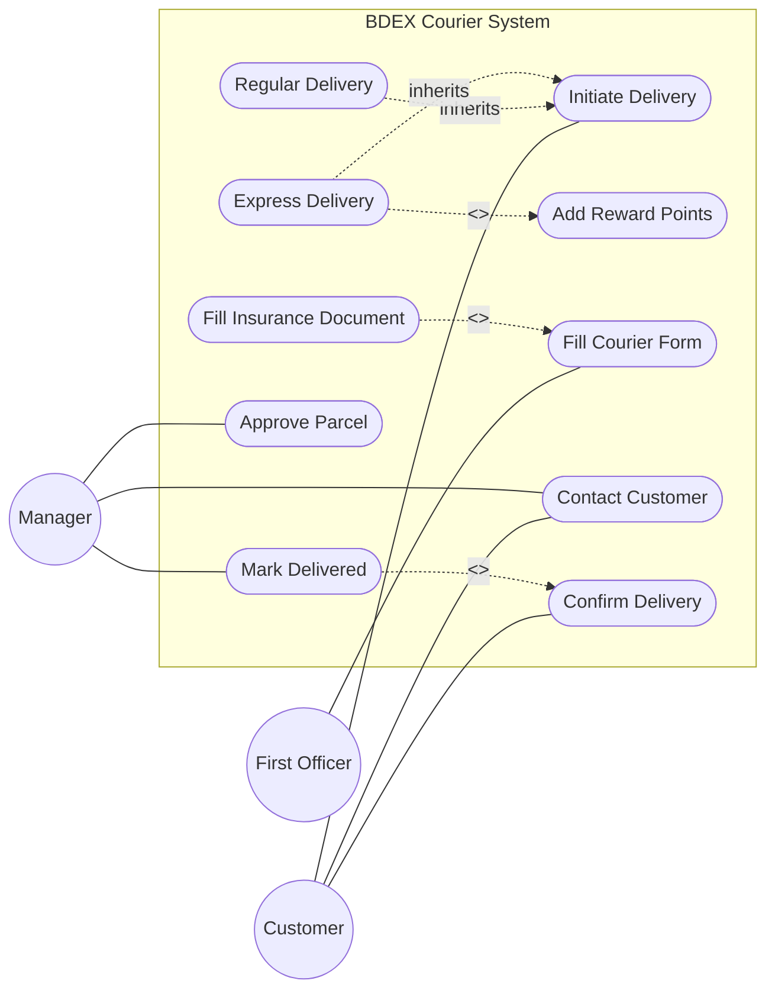

# Use Case Diagram: BDEX Courier

Welcome back! Let's tackle the BDEX Courier system. This one has some interesting conditional behaviors and multiple roles.

## Step 1: Identify the Actors
- **Customer**: Initiates delivery, chooses delivery type, receives contacts.
- **First Officer**: Fills out forms, handles packaging documents.
- **Manager**: Approves parcels, contacts customers, marks deliveries.

*Notice that these are three distinct actors with different roles. There is no generalization here because they aren't subtypes of a single generic user.*

## Step 2: Extract the Use Cases
- **Customer**: Initiate Delivery, Choose Delivery Type, Confirm Delivery.
- **First Officer**: Fill Courier Form, Fill Insurance Document.
- **Manager**: Approve Parcel, Contact Customer, Mark Delivered.

## Step 3: Find the Relationships
- Choosing express delivery adds reward points. We can show this as **Express Delivery** `<<include>>` **Add Reward Points**.
- Filling out insurance is conditional (only for confidential/fragile items), so **Fill Insurance Document** `<<extend>>` **Fill Courier Form**.
- Manager marking the package as delivered requires customer confirmation, so **Mark Delivered** `<<include>>` **Confirm Delivery** (or the Customer simply participates in the Confirm Delivery use case).

## Step 4: The Complete Diagram

## Step 5: Self-Check
- Are the conditional rules represented correctly? Yes, `<<extend>>` handles the fragile items rule.
- Did I avoid generalization for actors? Yes, Customer, First Officer, and Manager are completely separate.
- Do arrows for `<<include>>` point from the base to the included use case? Yes!
