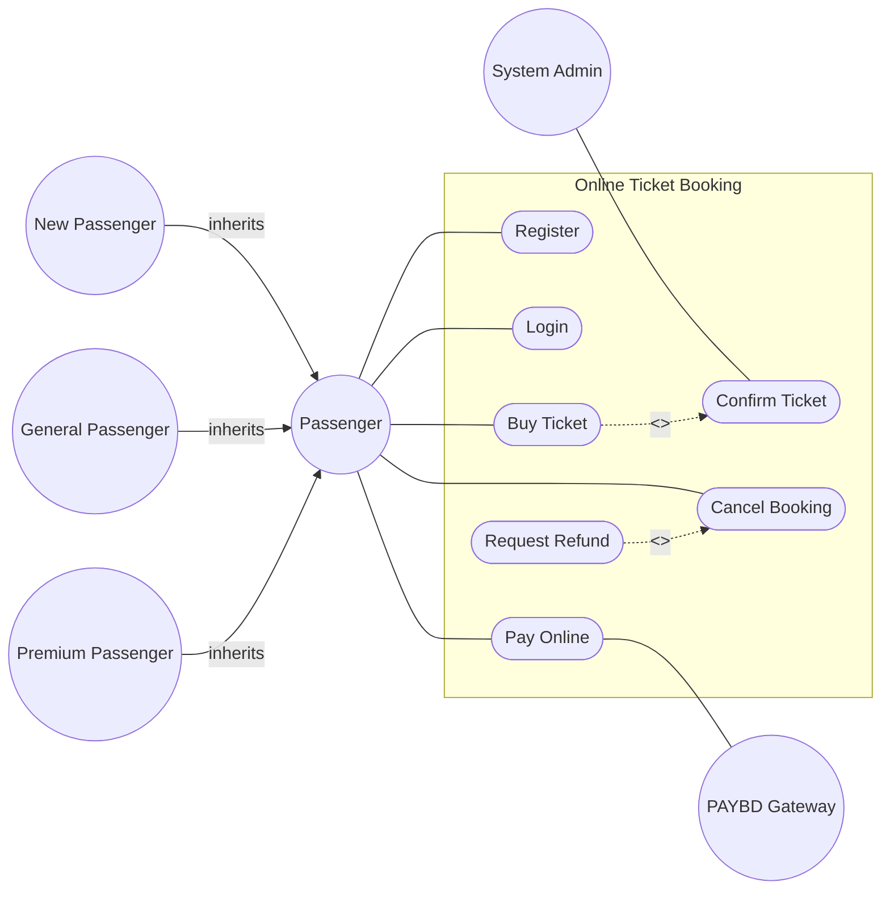

# Use Case Diagram: Ticket Booking

## 📋 Problem Statement

> Analyzing the system for online ticket booking, the following requirements were identified:
> * There can be three types of passengers: General, Premium and New
> * Passenger can register into the system with his – NID, Name, Email, Mobile Number, and Password
> * Passenger can login into the system with his email and password
> * Passenger can buy tickets
> * Tickets should be confirmed by the System Admin
> * Passenger can pay the ticket price online after being confirmed
> * Online payment should be using the "PAYBD" payment gateway
> * Passenger can cancel a booking
> * Passenger can request for return money for the canceled booking
>
> *Design a Use Case diagram based on the above information.*

---

Hello again! This Ticket Booking system is a classic example of actor generalization and secondary actors. Let's break it down!

## Step 1: Identify the Actors
- **Passenger**: A general actor.
- **General, Premium, New**: Subtypes of Passenger. This is a perfect spot for **Generalization**!
- **System Admin**: Confirms tickets.
- **PAYBD**: The payment gateway. This is a **Secondary Actor** because the system calls out to it.

## Step 2: Extract the Use Cases
- **Passenger (General)**: Register, Login, Buy Ticket, Pay Online, Cancel Booking, Request Refund.
- **System Admin**: Confirm Ticket.

## Step 3: Find the Relationships
- **Generalization**: General, Premium, and New actors inherit from Passenger. *Note: "New" is an actor here because they can only Register and haven't logged in yet.*
- **Buy Ticket** requires admin confirmation, so **Buy Ticket** `<<include>>` **Confirm Ticket**.
- **Pay Online** relies on PAYBD, so the use case connects to the PAYBD actor.
- Requesting a refund happens after a cancellation, usually as an optional step, so **Request Refund** `<<extend>>` **Cancel Booking**.

## Step 4: The Complete Diagram

## Step 5: Self-Check
- Did I capture the actor generalization correctly? Yes, New, General, and Premium inherit from Passenger. Arrow points FROM child TO parent.
- Is PAYBD shown as an external/secondary actor? Yes, connected to Pay Online.
- Is Request Refund an extend? Yes, it's optional behavior after a cancellation.
