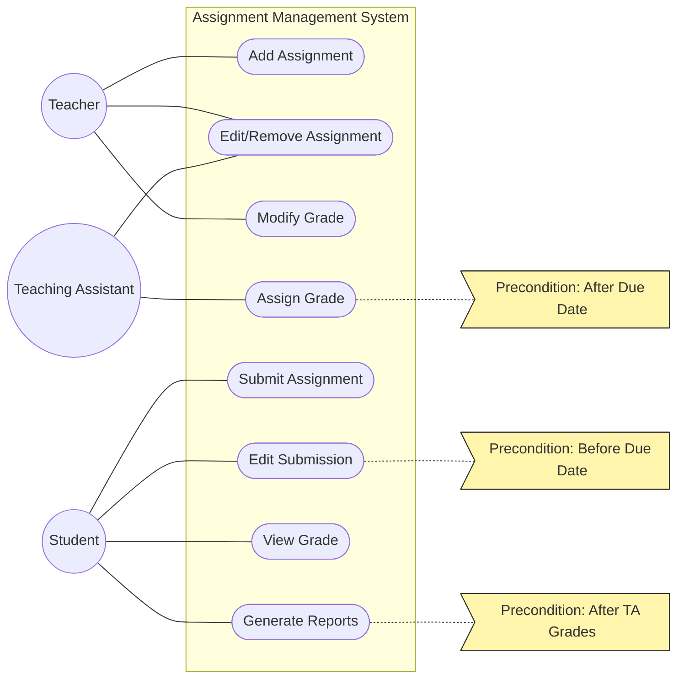

# Use Case Diagram: Assignment Management System

## 📋 Problem Statement

> Analyzing the system for student assignment management, the following requirements were identified:
> * There can be three types of users: Teacher, Teaching Assistant (TA) and Student
> * Teacher can add new assignments
> * Teacher can edit/remove an existing assignment
> * TA can edit/remove an existing assignment
> * Student can submit an assignment
> * Student can edit his submission (before due date)
> * TA can assign grade to submission (after due date)
> * Teacher can modify grade after graded by the TA
> * Student can view grade
> * Student can generate reports of his submissions after graded by the TA
>
> *Design a Use Case diagram based on the above information.*

---

Welcome to the Assignment Management System Use Case exercise! Let's break down this problem step-by-step and learn how to map it into a complete Use Case Diagram.

## Step 1: Identify the Actors
Who interacts with the system?
Based on the problem description, we have three clear types of users:
1. **Teacher**
2. **Teaching Assistant (TA)**
3. **Student**

Since this system handles assignment submissions, grading, and reporting purely through user actions, there are no secondary actors (external systems) mentioned.

## Step 2: Extract the Use Cases
What can each actor DO? Let's map out the actions (verbs) for each actor.

* **Teacher**:
    * Add new assignments
    * Edit/remove an existing assignment
    * Modify grade
* **TA**:
    * Edit/remove an existing assignment
    * Assign grade to submission
* **Student**:
    * Submit an assignment
    * Edit submission
    * View grade
    * Generate reports of submissions

Notice that both the **Teacher** and **TA** can "Edit/remove an existing assignment". We could use Generalization (where both inherit from a common parent like "Instructor"), but since they have other distinct use cases, the simplest and clearest approach is to connect both actors directly to the same shared use case.

## Step 3: Find the Relationships
Let's look closely at dependencies and conditions.

* **Modify Grade**: The teacher modifies the grade *after* it's graded by the TA. Should this be an `<<include>>` or `<<extend>>`? Actually, it's best modeled as a standalone use case (`Modify Grade`) that the Teacher performs. The sequencing (after TA grades) is a business rule, not necessarily a structural dependency we *have* to model with an arrow, but it's important context.
* **Generate Reports**: The student can generate reports *after* the assignment is graded. This is a precondition constraint.

## Step 4: The Complete Diagram

Here is the Mermaid representation of our system. Notice how we use a flat graph with clear labels to represent the structure.

## Step 5: Self-Check
When you draw this diagram yourself, ask these questions to verify your work:
1. **Did I use verbs for use cases?** Yes (Add, Edit, Modify, Assign, Submit, View, Generate).
2. **Are there any floating actors or use cases?** No, every actor connects to at least one use case, and every use case connects to at least one actor.
3. **Are actors outside the boundary?** Yes, the boundary encapsulates the actions, while the users remain outside.
4. **How did I handle shared actions?** Teacher and TA both connect to `Edit/Remove Assignment` directly, which keeps the diagram simple and accurate without unnecessary inheritance.
