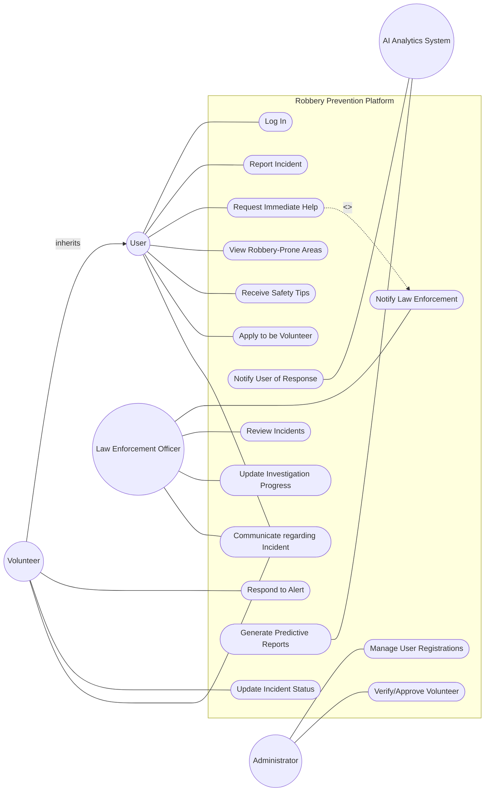

# Use Case Diagram: Community Robbery Prevention Platform

This is a complex scenario with multiple actors, shared use cases, and secondary systems. Let's tackle it methodically.

## Step 1: Identify the Actors
Who or what interacts with the system?
1. **User**: Registered users reporting incidents.
2. **Volunteer**: "Users who act as volunteers" - this hints at a relationship!
3. **Law Enforcement Officer**: Responds to alerts and updates progress.
4. **Administrator**: Oversees the system and manages registrations.
5. **AI Analytics System**: Provides predictions and reports. This is a *secondary actor* (an external system or internal autonomous subsystem that the platform interacts with).

**Key Insight:** Since "any user can apply to be a volunteer", a **Volunteer** is a specific type of **User**. This is a perfect candidate for **Generalization** (Volunteer inherits from User).

## Step 2: Extract the Use Cases
Let's group the actions by actor.

* **User**:
    * Log in
    * Report robbery incident
    * Request immediate help (Panic Button)
    * View robbery-prone areas
    * Receive safety tips
    * Apply to be volunteer
* **Volunteer** (Inherits User actions, plus):
    * Respond to emergency alert
    * Update incident status
    * Communicate with law enforcement
* **Law Enforcement Officer**:
    * Receive emergency notification
    * Review reported incidents
    * Update investigation progress
    * Communicate with users and volunteers
* **Administrator**:
    * Manage user registrations
    * Manage volunteer registrations
    * Verify/approve volunteer applications
* **System / AI System (Secondary)**:
    * Generate predictive reports (AI)
    * Notify user (when volunteer responds)

## Step 3: Find the Relationships
This is where the diagram gets interesting!

* **Generalization**: `Volunteer -->|inherits| User`
* **Include Relationship**: Pressing the panic button *always* notifies law enforcement. Therefore: `Request Immediate Help -.->|<<include>>| Notify Law Enforcement`.
* **Communication**: Multiple actors (Volunteer, Law Enforcement, User) share "Communicate" use cases. We need to be careful with layout to avoid spaghetti lines.
* **Secondary Actor**: The AI Analytics system sits on the right side, as it's typically providing a service to the system.

## Step 4: The Complete Diagram

## Step 5: Self-Check
1. **Did I handle the User/Volunteer relationship correctly?** Yes, by using Generalization, we don't have to draw lines from Volunteer to "Log In" or "Report Incident". They get those for free!
2. **Is the Include relationship pointing the right way?** Yes, `Panic Button` (base) points to `Notify Law Enforcement` (included). The panic action *depends* on the notification happening.
3. **Is the AI Analytics System modeled properly?** Yes, as a secondary actor on the right side, interacting with the specific reporting/notification use cases.
4. **Is the diagram readable?** By consolidating communication into a shared use case, we avoided a tangled mess of lines.
