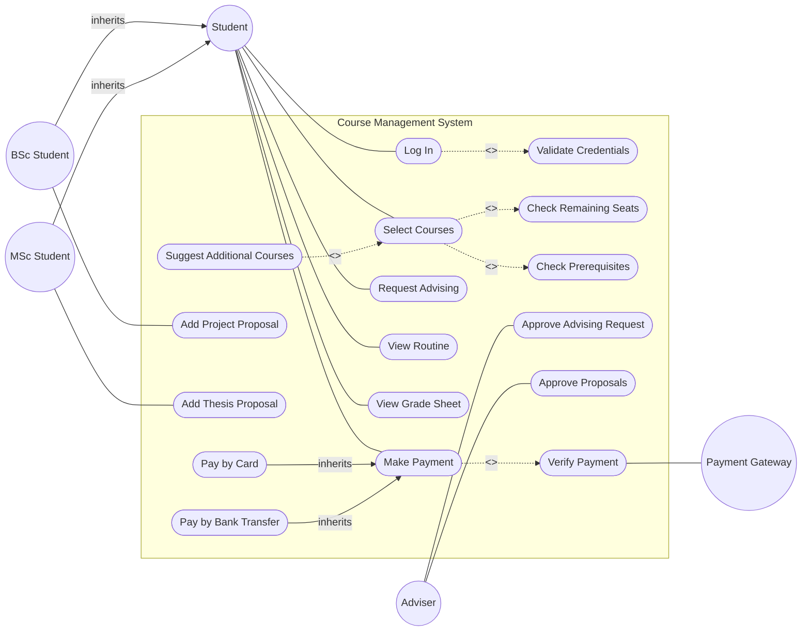

# Use Case Diagram: Course Management System

## 📋 Problem Statement

> Suppose you have been hired to design a course management system. The requirements for the system are as follows:
> Two types of students will use this system, BSc, and MSc. Students will be able to log in to the system using a username and password. The system will check whether the credentials are valid and will give an error message if they are incorrect. Students will be able to select courses they want to complete next semester. The system will check whether the course has remaining seats and if the student has completed all pre-requisite courses to take the course. The system might suggest additional courses to the students when taking a course. After a student has completed selecting courses then he/she might request for advising, and an adviser will approve the advising request. Students can view their routine and grade sheet. BSc students can add project proposals whereas MSc students can add thesis proposals and those will be approved by the advisor. Students can also make payments. Payments can be made via card or bank transfer; payment must be verified by the system.
>
> *Design a Use Case Diagram based on the above information.*

---

This problem is a masterclass in handling inheritance (generalization) and relationships (`<<include>>` vs `<<extend>>`). 

## Step 1: Identify the Actors
Who interacts with the system?
1. **Student** (General)
2. **BSc Student** (Specific)
3. **MSc Student** (Specific)
4. **Adviser**
5. **Payment Gateway / System** (Implied secondary actor for payment verification)

**Key Insight:** This is a classic example of **Actor Generalization**. Both BSc and MSc students share many actions but have specific unique actions. 

## Step 2: Extract the Use Cases
Let's group the actions.

* **Student (Common)**:
    * Log in
    * Select courses
    * Request for advising
    * View routine
    * View grade sheet
    * Make payment
* **BSc Student**:
    * Add project proposal
* **MSc Student**:
    * Add thesis proposal
* **Adviser**:
    * Approve advising request
    * Approve project/thesis proposals
* **System / Background processes**:
    * Validate credentials
    * Check remaining seats
    * Check prerequisites
    * Suggest additional courses
    * Verify payment

## Step 3: Find the Relationships
This problem is packed with rich UML relationships!

* **Actor Generalization**: `BSc Student -->|inherits| Student` and `MSc Student -->|inherits| Student`.
* **Include (`<<include>>`)**:
    * `Log In` ALWAYS requires `Validate Credentials`: `Log In -.->|<<include>>| Validate Credentials`
    * `Select Courses` ALWAYS requires checking seats and prerequisites: 
        * `Select Courses -.->|<<include>>| Check Remaining Seats`
        * `Select Courses -.->|<<include>>| Check Prerequisites`
* **Extend (`<<extend>>`)**:
    * `Suggest Additional Courses` is OPTIONAL when selecting courses. The arrow points FROM the extending use case TO the base use case: `Suggest Additional Courses -.->|<<extend>>| Select Courses`
* **Use Case Generalization**: Payments can be made via card or bank transfer. 
    * `Pay by Card -->|inherits| Make Payment`
    * `Pay by Bank Transfer -->|inherits| Make Payment`

## Step 4: The Complete Diagram

## Step 5: Self-Check
1. **Did I point the Include and Extend arrows correctly?**
   * **Include**: Arrow points from Base to Included (Select Courses -> Check Seats).
   * **Extend**: Arrow points from Extending to Base (Suggest Courses -> Select Courses).
2. **Did I capture the difference between BSc and MSc properly?** Yes, by defining them as child actors, they inherit all standard student functions but have their own unique links to the project/thesis proposal use cases.
3. **Are internal processes properly represented?** Yes, things like "Validate Credentials" and "Check Prerequisites" are modeled as included use cases, not as actors.
