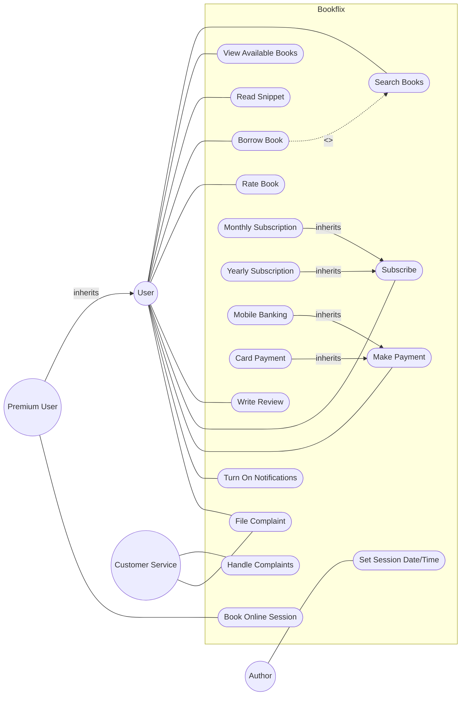

# UML Use Case Diagram Tutorial: Bookflix

Hello there! Welcome back to our UML studies. Today, we're going to break down a problem about an online book borrowing system called **Bookflix**. We'll extract the actors, use cases, and relationships step by step. Grab your notebook, and let's dive in!

## Problem Statement
Bookflix is an online book borrowing system. In this system, a user can view a list of books that are available for borrowing. They have to search for the books by author or book name first. They can also read snippets before borrowing a book. The users can rate the books and also write reviews about the books they borrow. This system has two types of subscription service: monthly and yearly. There are two types of payment methods in this system: mobile banking and card. A user will be upgraded to a premium user, if he/she avails of the yearly package. Premium users can view available slots to book for online sessions with the book authors. The authors will set the date and time of the online sessions. The user will receive notification about best-selling books that are available. Users can turn on notifications for their desired books to know their availability. They will also get a notification about the due payments. Customer service will be available for the users to get help and file complaints. Customer service will provide feedback and take necessary actions upon the complaints. *(Note: You don't have to draw any authentication related use cases).*

---

## Step 1: Identify the Actors
*Who interacts with the system?*
As we read through the text, let's pick out the nouns that represent people or external systems interacting with Bookflix.

1. **User**: The primary person interacting with the system (borrowing, reading, paying).
2. **Premium User**: A specific type of User who gets extra perks (booking sessions). Since a Premium User can do everything a regular User can do, this is a perfect candidate for **Generalization** (Premium User inherits from User).
3. **Author**: They set the date and time for online sessions. Yes, they interact directly with the system to do this!
4. **Customer Service**: They handle complaints and provide feedback. They are an actor too.

*Wait, what about the Notification System?* The problem mentions users receive notifications. We could model an external Notification System as a secondary actor, but it's also perfectly fine to model "Receive Notifications" as a system feature. Let's keep it simple and just use the human actors.

## Step 2: Extract the Use Cases
*What can each actor DO?*
Remember, use cases should be **Verb + Noun** phrases. Let's list them:

**User Actions:**
- Search Books (the text says they search by author or book name. Instead of making two use cases, one "Search Books" is cleaner).
- View Available Books
- Read Snippets
- Borrow Book
- Rate Book
- Write Review
- Subscribe
- Make Payment (mobile banking or card are just generalizations or variations of making a payment)
- Turn On Notifications
- Get Help / File Complaint

**Premium User Actions:**
- Book Online Session

**Author Actions:**
- Set Session Date and Time

**Customer Service Actions:**
- Handle Complaints (Provide Feedback / Take Action)

## Step 3: Find the Relationships
Now, let's connect the dots and look for special relationships (`<<include>>`, `<<extend>>`, or generalizations).

1. **Actor Generalization**: 
   - `Premium User -->|inherits| User`
2. **Use Case Include (`<<include>>`)**:
   - The prompt says they "have to search for the books... first" before viewing the list of available books. We could say `Borrow Book -.->|<<include>>| Search Books` or `View Available Books -.->|<<include>>| Search Books`. Let's connect `Borrow Book` and `Search Books`.
3. **Use Case Generalization**:
   - The user can subscribe monthly or yearly. We can make "Monthly Subscription" and "Yearly Subscription" inherit from a general "Subscribe" usecase.
   - Payment methods (Mobile Banking, Card) can inherit from "Make Payment".

## Step 4: The Complete Diagram

Here is our final Mermaid diagram. Notice how actors are on the outside, and the use cases are inside the system boundary (Bookflix).

## Step 5: Self-Check
Ask yourself these questions to make sure your diagram is solid:
1. **Are all use cases verbs?** Yes (Search, View, Read, Borrow, etc.).
2. **Are there any floating use cases?** No, every use case is connected to an actor or another use case.
3. **Is the system boundary present?** Yes, the `subgraph Bookflix` creates our box.
4. **Did we include "Login/Register"?** No! The problem explicitly told us to skip authentication. Always follow the constraints!
5. **Did we make Bookflix an actor?** No. The system itself is never an actor in its own use case diagram. It is the boundary.

Great job! You've successfully mapped out a complex system with multiple actor levels and inheritance. Let's move on to the next one!
