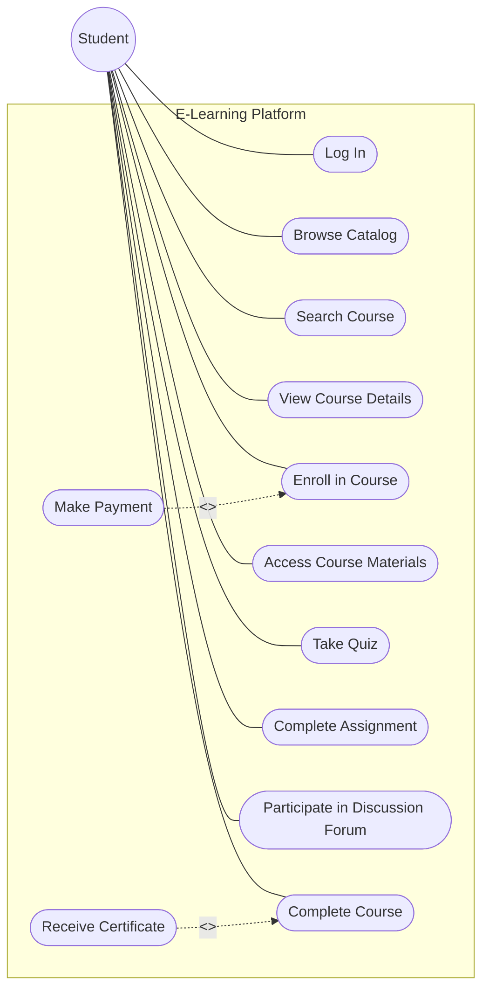

# UML Use Case Diagram Tutorial: E-Learning Platform

Welcome back! In this tutorial, we are going to look at a slightly simpler scenario. This is a great exercise for building confidence and learning how to filter out "internal system behaviors" from actual user actions.

## Problem Statement
This scenario focuses on a student enrolling in a course and completing coursework on an e-learning platform.
The student accesses the E-Learning Platform and logs in with their account credentials. Then he/she can browse the course catalog and search for a course of interest. Students views the course details, including description, learning objectives, instructor information, and prerequisites (if any). When a student decides to enroll in the course, they may need to pay a fee or use a subscription depending on the platform's model. The E-Learning Platform processes the enrollment and grants the student access to the course content. The student accesses the course materials, which may include videos, lectures, readings, quizzes, and assignments. The student progresses through the course content at their own pace, completing learning activities. Students take quizzes and complete assignments as required by the course. The E-Learning Platform grades these assessments and provides feedback. The student interacts with the discussion forum or other communication tools within the course to ask questions and collaborate with other learners. Upon completing all course requirements, the student may receive a certificate of completion or a grade, depending on the platform and course structure.

---

## Step 1: Identify the Actors
*Who interacts with the system?*
Reading through the text, there is only one primary human interacting with the system:
1. **Student**

*Common Mistake Alert!* 
Is the "E-Learning Platform" an actor? **No.** The platform is the SYSTEM we are designing. It is the boundary, not an actor. 
Is the "Instructor" an actor here? The text mentions viewing "instructor information", but it doesn't actually describe the instructor interacting with the system in this specific scenario. So, we will not include the Instructor.

## Step 2: Extract the Use Cases
*What can the Student DO?*
Let's find the verbs:
- Log in
- Browse Catalog
- Search Course
- View Course Details
- Enroll in Course
- Make Payment (The text says "they may need to pay a fee")
- Access Course Materials
- Take Quiz
- Complete Assignment
- Participate in Discussion Forum
- Receive Certificate/Grade (or "Complete Course")

*What about "The E-Learning Platform processes the enrollment" or "grades these assessments"?* 
These are **internal system behaviors**. Use cases represent goals the user achieves, not internal database processing. We do not make "Process Enrollment" a use case!

## Step 3: Find the Relationships
Let's look for our `<<include>>` and `<<extend>>` relationships.
1. **Optional Payment**: The text says they *may* need to pay a fee when enrolling. Since it's optional, **Make Payment** optionally extends **Enroll in Course**. Remember: The arrow points FROM the extending use case TO the base use case.
2. **Optional Certificate**: The text says "may receive a certificate". So, **Receive Certificate** optionally extends a general completion action (like **Complete Course** or **Access Course Materials**). We'll make it extend **Complete Course**.

## Step 4: The Complete Diagram

## Step 5: Self-Check
- **Did we make the system an actor?** No, "E-Learning Platform" is correctly used as our system boundary (`subgraph`).
- **Are all use cases verbs?** Yes (Log In, Browse, Search, Enroll, etc.).
- **Are extend arrows pointing the right way?** Yes, from the optional use case (`Make Payment`) pointing to the base use case (`Enroll in Course`). This means "Making a payment extends the process of enrolling".
- **Did we leave out internal processes?** Yes, we ignored "processes the enrollment" and "grades these assessments".

This scenario teaches a very important lesson: **Not everything mentioned in the text is a use case.** Be a detective and filter out the internal system actions!
