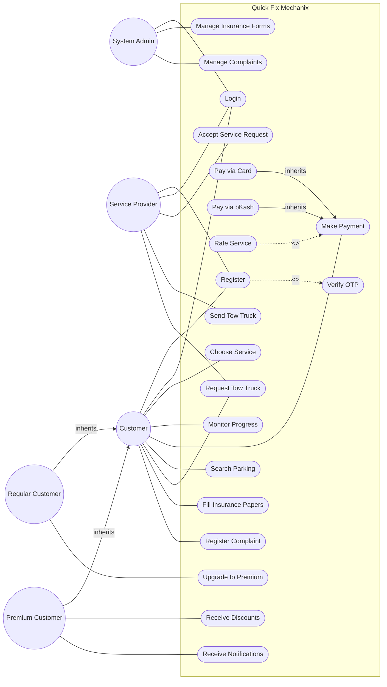

# UML Use Case Diagram Tutorial: Quick Fix Mechanix

Welcome to the capstone problem! This one is called **Quick Fix Mechanix**. It is a complex scenario with multiple levels of actors, inheritance, and shared use cases. If you can master this, you are well on your way to acing your UML exams.

## 📋 Problem Statement
Quick Fix Mechanix is a system developed with the aim of easing the hassles of modern-day car servicing problems by providing proper car care solutions that can be monitored remotely from anywhere. The users of the system include Regular Customers, Premium Customers and Service Providers. All the users of the system will first register and then login to the system. Registration will be verified through OTP. Customers will be able to choose a specific service (cleaning, repairing, health checkup) from the garage of his/her choice. The customer can choose a service type like home or in-garage service. If the service provider (garage) accepts a service request, the customer will be able to monitor the progress of the service. After the completion of the service, the consumer will be able to complete the payment transaction (using card or bkash) through the system and optionally can also provide rating on the services. The customer will be able to search for nearby available parking slots. He/she can also request for tow-truck service using an emergency button. Nearby garages can accept the request and send a tow-truck. Regular customers can upgrade to premium subscription for a monthly charge. Premium customers will get discounts on various services and will get notifications for offers on the services. When the next service is due, he/she will receive notification from the system. Consumers will be able to fill up relative insurance papers through the system. The system admin manages insurance forms. Customers can also register complaints upon receiving a service. The admin manages complaints upon receiving any complaints.

---

## Step 1: Identify the Actors
This text is packed with actors! Let's break them down.
1. **Customer**: A general actor.
2. **Regular Customer**: A specific type of customer.
3. **Premium Customer**: Another specific type of customer.
   *Teaching Note:* This is a perfect setup for **Generalization**. `Regular Customer` and `Premium Customer` will both inherit from `Customer`. This saves us from drawing a million lines!
4. **Service Provider (Garage)**: They accept requests and send tow trucks.
5. **System Admin**: They manage forms and complaints.
6. **OTP System** (Optional Secondary Actor): The system verifies registration through OTP. You could model this as an external actor, but we'll treat it as an internal use case (`Verify OTP`) for simplicity here.

## Step 2: Extract the Use Cases
Let's group the use cases by who performs them.

**Shared Actions (All Users: Customers & Providers):**
- Register
- Login

**General Customer Actions:**
- Choose Service
- Monitor Progress
- Make Payment (Card / bKash)
- Rate Service
- Search Parking
- Request Tow Truck
- Fill Insurance Papers
- Register Complaint

**Regular Customer Actions:**
- Upgrade to Premium

**Premium Customer Actions:**
- Receive Discounts
- Receive Notifications (Offers / Service Due)

**Service Provider Actions:**
- Accept Service Request
- Send Tow Truck

**System Admin Actions:**
- Manage Insurance Forms
- Manage Complaints

## Step 3: Find the Relationships
This is where the magic happens.
1. **Actor Generalization**: 
   - `Regular Customer -->|inherits| Customer`
   - `Premium Customer -->|inherits| Customer`
2. **Include (`<<include>>`)**:
   - Registration MUST be verified by OTP. So, `Register -.->|<<include>>| Verify OTP`.
3. **Extend (`<<extend>>`)**:
   - The user "optionally can also provide rating". So, `Rate Service -.->|<<extend>>| Make Payment` (or `Complete Service`).
4. **Use Case Generalization**:
   - Payment via Card or bKash. `Pay via Card -->|inherits| Make Payment` and `Pay via bKash -->|inherits| Make Payment`.
5. **Cross-Actor Interaction**:
   - The Customer requests a tow truck (`Request Tow Truck`), and the Service Provider accepts and sends it. Both actors can connect to the same use case (e.g., `Manage Tow Truck Request`), or they have their own use cases that represent their half of the transaction. We'll connect both to a central `Request/Provide Tow Truck` use case for clarity.

## Step 4: The Complete Diagram

## Step 5: Self-Check
- **Is Generalization pointing the right way?** Yes, from Child (Regular/Premium) to Parent (Customer). The child gets all the powers of the parent!
- **Is Include pointing the right way?** Yes, from the base case (Register) to the mandatory included case (Verify OTP).
- **Are there any floating use cases?** No, every action belongs to an actor. Admin manages what the Customer fills out.
- **Did we capture optional behavior?** Yes, Rating the service is optional, so it has an `<<extend>>` relationship.

Excellent work! You have navigated a very complex system with multiple actors, shared permissions, and intricate relationships. Review this example whenever you need a reminder of how all the UML Use Case pieces fit together.
